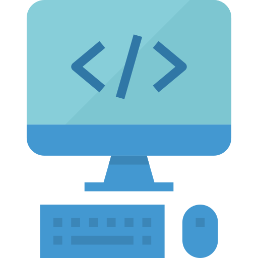

<h1>Hello there </h1>

- 🌱 I'm currently learning **MongoDB, DSA, DevOps, Hacking**.

- 🤝 I'm looking for help with **Open source**.

- 💬 Ask me about **C , HTML , CSS , JavaScript , Python , TailwindCSS , React , NextJs, NodeJs, Express , C++ , Atri, Bootstrap, Docker, D-ID, STRIPE, VEROTEL, Git and GitHub**.

- 📫 How to reach me **9u.harsh@gmail.com**.

- 📝 My [Blog](https://dev.to/thisisharsh7/before-you-start-coding--357b "My First Dev Blog").

 
 
<!-- Some badges are from https://github.com/Ileriayo/markdown-badges -->

### 🎓Skills

 
<table>
<tr>
<td align="center" width="96">
    
     Web Development
</td>
<td align="center" width="96">
    
     Problem Solving
</td>
</tr>
</table>

 
 

### 👨‍💻 Programming Languages

 

    
    
    
    
    
    
    
    
    

 

### 🧰 Frameworks & Libraries

 

   
   
    
        

 

### 🗄️ Databases & Hosting

 

    
    
    
    

 

### 💻 Software & Tools

 

    
    
    
    
    
    

 
 

  
  

 

## 🔥 Streak Stats

 
<!-- GitHub Readme Streak Stats - https://github.com/DenverCoder1/github-readme-streak-stats -->

  

